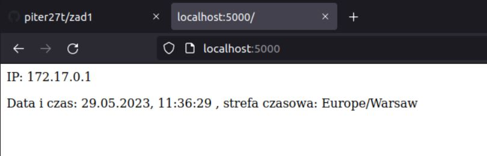

# Sprawozdanie
## Zad 3
a) Aby zbudować opracowany obraz kontenera użyłem polecenia ```docker build -t image_zad1 .```

b) Aby uruchomić kontener na podstawie zbudowanego obrazu użyłem polecenia ```docker run -p 5000:8080 -it --rm --name zad1 image_zad1```



c) Aby uzyskać informacje, które wygenerował serwer, po uruchomieniu kontenera otworzyłem drugi terminal i wpisałem następujace polecenie ```docker logs zad1``` 


d) Aby sprawdzić ile warstw posiada zbudowany obraz użyłem polecenia ```docker history image_zad1```


