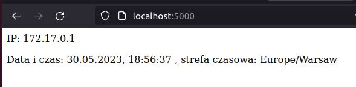

# zad1_dodatkowe

## Punkt 2.
Zbudować  obrazy  kontenera  z  aplikacją  opracowaną  w  punkcie  nr  1,  które  będą  pracował  na 
architekturach: linux/arm/v7, linux/arm64/v8 oraz linux/amd64 wykorzystując sterownik docker-
container.

Stworzenie nowego builder-a:  ```docker buildx create --name zad1builder```

Ustawienie stworzonego builder-a: ```docker buildx use zad1builder```

Sprawdzenie stanu builder-a ```docker buildx inspect --bootstrap```


Nie udalo sie stworzyc obrazu dla linux/arm/v7 (po 30min dalej tworzy sie obraz dla tej architektury). Polecenie aby stworzyc obraz na 3 architektury: 

```docker buildx build -t docker.io/piter27t/zad1_dod --platform linux/amd64,linux/arm64/v8,linux/arm/v7 --push .```

Zbudowanie obrazow dla dwoch architektur (linux/arm64/v8 oraz linux/amd64):

```docker buildx build -t docker.io/piter27t/zad1_dod --platform linux/amd64,linux/arm64/v8 --push .```


Przetestowanie: 

```docker pull piter27t/zad1_dod```

```docker run -p 5000:8080 --name zad1_dod piter27t/zad1_dod```


Efekt działania w przeglądarce:



